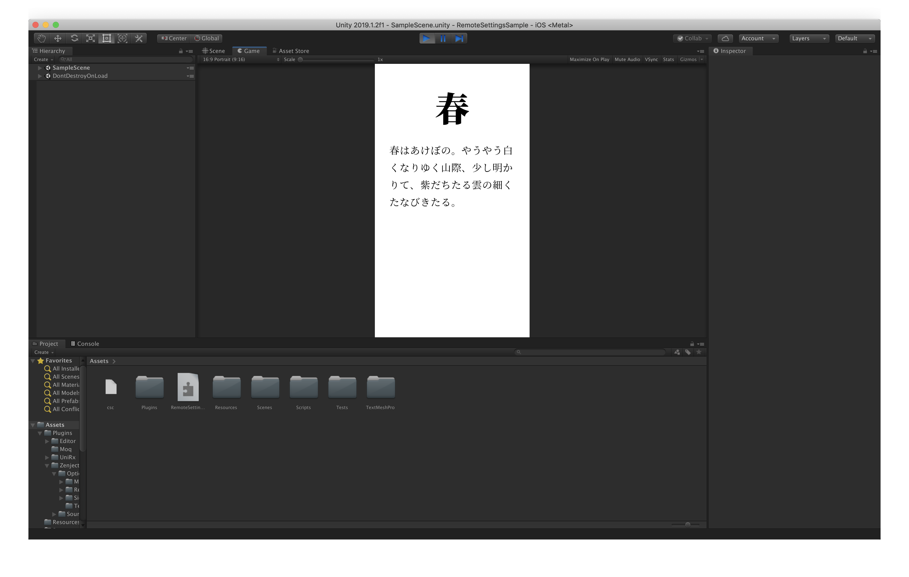

# Unity RemoteSettings Demo



## Summary

2019/05/18 (Sat) に開催された「[Unity の集い in 大阪](https://meetup.unity3d.jp/jp/events/1063)」で用いたデモプロジェクトです。

Unity RemoteSettings にて設定した季節の値に応じて、枕草子のテキストを切り替えて表示します。

## Requirements

* Unity 2019.1

## Install / Setup

### 1.プロジェクトを開く

```bash
git clone git@github.com:monry/RemoteSettingsSample.git
```

### 2.Unity Analytics を有効にする

#### 2-1. Services タブを表示


#### 2-2. プロジェクトを作成

##### まだ [Unity Services](https://developer.cloud.unity3d.com/) 上にプロジェクトを作成していない場合


##### 既にプロジェクトを作成している場合


### 3. Unity RemoteSettings を設定する

1. [Unity Services](https://developer.cloud.unity3d.com/) にログイン
1. 上部メニューの Operate タブよりプロジェクトを選択
1. 左メニューの Optimization &gt; Remote Settings <sup><small>BETA</small></sup> を選択
1. Editor や Development Build での確認を行う場合は環境ボタンから Development を選択<br />
1. ADD NEW KEY-VALUE ボタンを押下し、設定を入力<br />
1. Sync ボタン押下で同期

入力するパラメータは以下の通り

| Field | Value | Description |
| --- | --- | --- |
| Key | `Season` | `RemoteSettings.GetInt(string key)` の引数 |
| Type | Integer | プログラム側で `enum Season` にキャストします |
| Value | `1..4` | 1: 春, 2: 夏, 3: 秋, 4: 冬 |

## Libraries

* [UniRx](https://github.com/neuecc/UniRx)
* [Zenject](https://github.com/svermeulen/Extenject)
* [Moq](https://github.com/moq/moq)

## License

[MIT License](LICENSE.txt)
